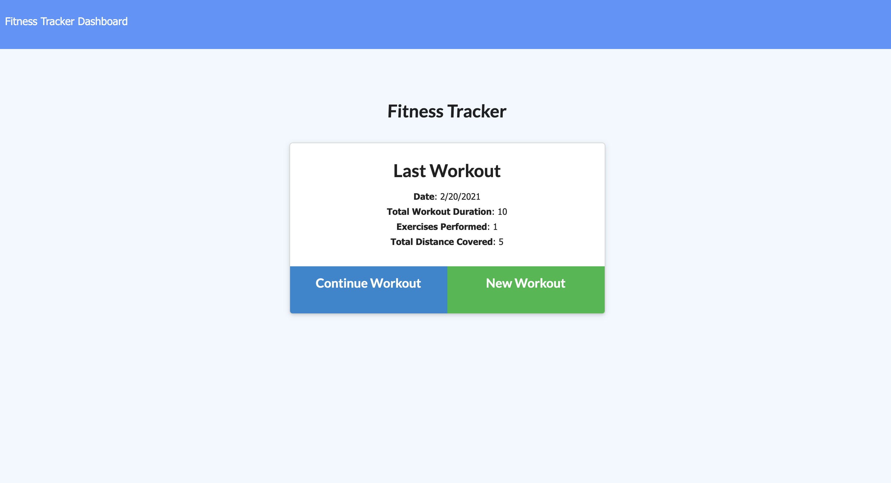
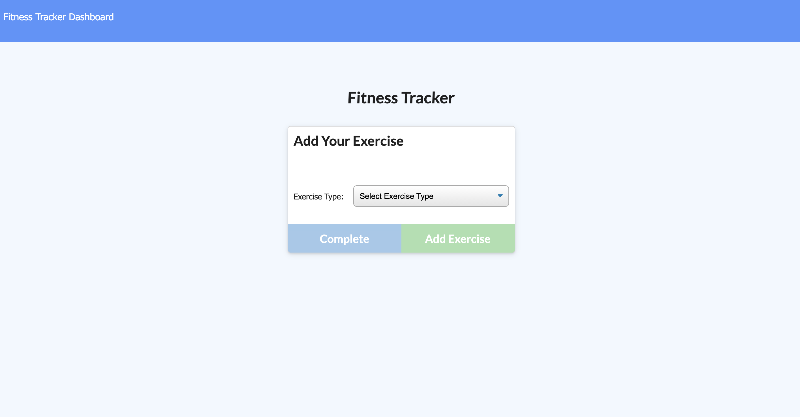
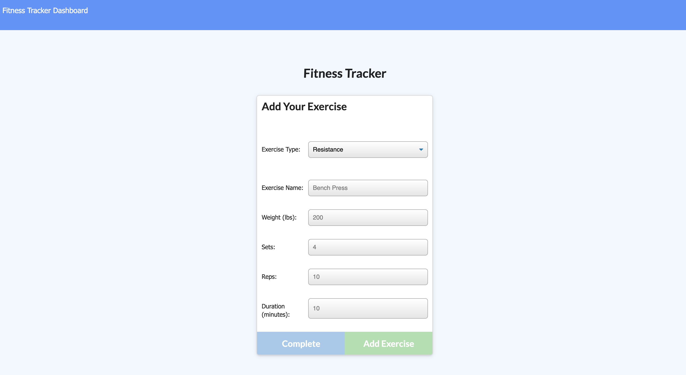
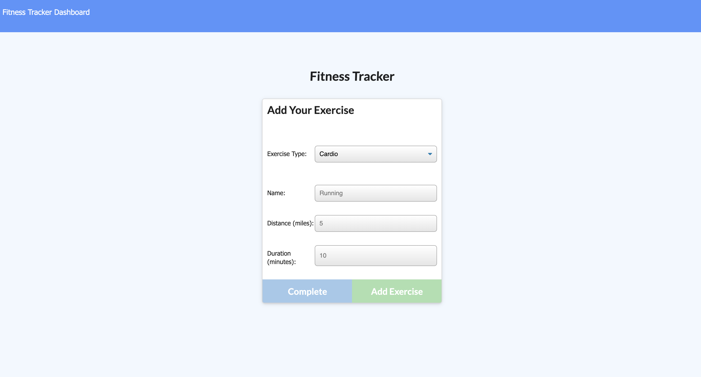
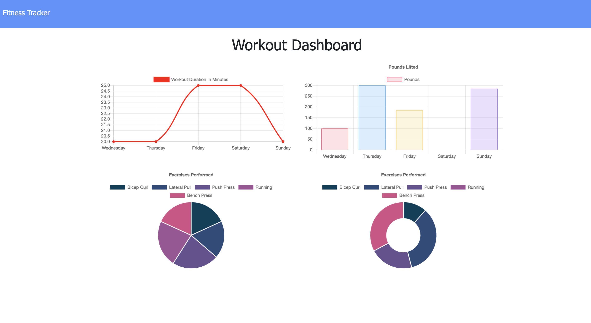

# Workout Tracker

 

A fitness app that allows users to create, view and track daily workouts. The user is able to log multiple exercises in a given day and also go back and update the workout. The user is able to track the name, type, weight, sets, reps and duration of each exercise. Cardiovascular exercises show the distance traveled in miles.

## Table of Contents

* [Installation](#installation)
* [Usage](#usage)
* [Links](#Links)
* [Features](#Features)
* [License](#License)

## Installation

1. Download or clone repository
2. `npm install` to install the required npm packages to run
3. To have a prepopulated database, run `npm seed`

## Usage

* Application will be invoked by using the following command:

  `node server.js`

* Open your browser and go to
  
  `http://localhost:8080`

  The home page will show the user's last workout details, then the user will have the option to select **Continue Workout** or **New Workout**

  

* After selecting an option, the user can add their exercise by choosing an **Exercise Type**

  * *Resistance* or
  * *Cardio*

  

* If *Resistance* is selected, the user input the following required fields:

  * Exercise Name
  * Weight in lbs
  * Sets
  * Reps
  * Duration in minutes

    

* If *Cardio* is selected, the user input the following required fields:

  * Name
  * Distance in miles
  * Duration in minutes

  

* After the required the fields are entered, the user can select **Complete** or **Add Exercise** to save the workout

* There is a **Dashboard** that tracks all the workouts that was entered in graphic details

  

## Links

* [Github](https://github.com/mmeii/workout-tracker)
* [Live Heroku App](https://mt-workout-tracker.herokuapp.com/)

## Features

* JavaScript
* MySQL
* Node
* Express
* Handlebars
* Homemade ORM

## License

  Copyright (c) Mengmei Tu. All rights reserved.
  
  Licensed under the [MIT](LICENSE) license.
  